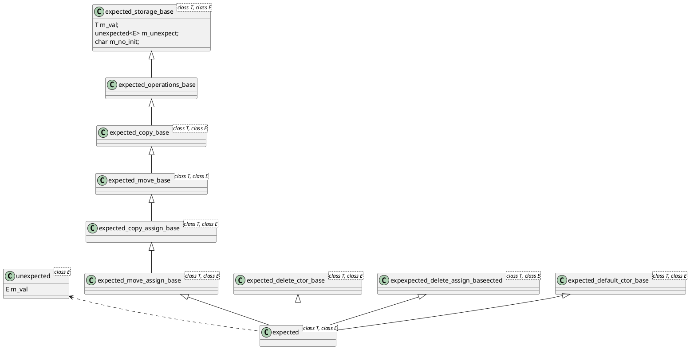
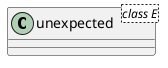

# expected

C++23では`std::expected`の追加が検討されています。ここでは`std::expected`
の概要と想定される使われ方を説明し、現時点で最も有名な実装を見ていきます。

## [P0323R10 std::expected](http://www.open-std.org/jtc1/sc22/wg21/docs/papers/2021/p0323r10.html)で語られている内容

 C++17 `std::optional`では有効な値を持つか、無効な値を持つかということが表現できていたが、`std::expected`は有効な値を持つか、どのようなエラーがあったかを示すことができます。また、モナドインターフェースは、エラー処理を別のレイヤーのコードに委ねるフレームワークを提供します。

 ```cpp
std::expected <int, std::string> func() {
    int num = function_that_can_cause_errors();
    if (num < 0) {
        return make_unexpected("結論だけ、書く。失敗した");
    }

    return num;
}

void main() {
    auto result = func();
    if (!result) {
        std::cout << result.error() << std::endl;
        // エラーリターンしたり
        return;
    }

    // 失敗時だけの処理を書いたり
    result.or_else([](auto x){ std::cout << x << std::endl; });


    // 値を抜き出したり
    std::cout << result.value() + 1 << std::endl;

    // 成功時だけの処理を書いたりできます
    result.or_else([](auto x){ std::cout << x + 1 << std::endl; });
}
```

## std::expectedの実装



## unexpected

まず`unexpected`について説明します。このクラスは、テンプレート引数にEをとり、`expected<T, E>`のE型を扱うためのクラスとなっています。



今回説明する`expected<T, E>`クラスは、成功時はT型、失敗時はE型を返すような場合に使用したいというクラスであるため、そもそもE型を`unexpected`に格納するまわりくどい作りに自体に疑問を持つ方へおられるかと思います。まず、理由を説明いたします。


`expected`はTかEのいずれかを受け取るため以下のようなコンストラクタを持つはずで、実はここに問題があります。
```cpp
template<class T, class E>
class expected {
    expected(T v);
    expected(E e);
}
```

例えば、TもEも`int`の場合を考えます。これは決して特殊なことではなく、レガシーコードではエラーコードを`int`で扱うことがありますので、`expected`がサポートするべき状況に該当します。さて結果はどうなるでしょうか。。。。


```cpp
template<int, int>
class expected {
    expected(int v);
    expected(int e);
}
```

見たらわかるとうり、`expected(int v)`が残念ながら２つあるためコンパイルエラーになってしまいます。このことを防ぐために、

```cpp
template<class T, class E>
class expected {
    expected(T v);
    expected(unexpected<e> e);
}
```

とする必要があります。

次はクラスのメンバーを見ていきますが、コンパイルエラーを避けるためのラッパーのため、E型のメンバーを`m_val`を持ち、いくつかのコンストラクタとメソッドを持つシンプルな作りです。

```cpp
template <class E> class unexpected {
    public:
        static_assert(!std::is_same<E, void>::value, "E must not be void");

        unexpected() = delete;
        constexpr explicit unexpected(const E& e) : m_val(e) {}
        constexpr explicit unexpected(E&& e) : m_val(std::move(e)) {}

        constexpr const E& value() const& { return m_val; }
        constexpr E& value()& { return m_val; }
        constexpr E&& value()&& { return std::move(m_val); }
        constexpr const E&& value() const&& { return std::move(m_val); }

    private:
        E m_val;
};
```

```
オマケ:メソッド末尾の&,&&

メンバ関数に付ける修飾子でstatic, virtual, inline/constexpr, const/volatile  
, noexcept/throw, override/finalは見たことがあるかと思いますが、ししゃものオスなみに  
知名度が低い&,&&を見たことがある人は少ないと思います。

一見するとワケワカメですが、こういった修飾子が修飾するのはthisポインタです。  
constを付けるとconstオブジェクトからしか呼べないように&&を付けると右辺値から  
しか呼べなくなるだけです。
```

## expected

```cpp
template <class T, class E>
class expected :
    private detail::expected_move_assign_base<T, E>,
    private detail::expected_delete_ctor_base<T, E>,
    private detail::expected_delete_assign_base<T, E>,
    private detail::expected_default_ctor_base<T, E> {
    static_assert(!std::is_reference<T>::value, "T must not be a reference");
    static_assert(!std::is_same<T, std::remove_cv<in_place_t>::type>::value,
        "T must not be in_place_t");
    static_assert(!std::is_same<T, std::remove_cv<unexpect_t>::type>::value,
        "T must not be unexpect_t");
    static_assert(!std::is_same<T, typename std::remove_cv<unexpected<E>>::type>::value,
        "T must not be unexpected<E>");
    static_assert(!std::is_reference<E>::value, "E must not be a reference");
```

`expected<T,E>`のコードを見ると上のようになっているのですが、まぁわからないと思います。(これがわかる人はここから先を読み必要ないよ。)  
以下の2点をまずはざっくり、詳細後ほどとします

- static_assert部分
`expected`が扱えるT,Eの特性を表明(assert)しています。

- private継承部分
`expected`が持つコンストラクタ、デストラクタなどの実装をT,Eの特性に合わせて切り替えます。

### static_assert  
コンパイル時Assertです。条件を満たさない型が渡されるとAssertionします。つまり、渡された型は`expected`が扱う型としては契約違反と親切に教えてくれているわけです。
```cpp
static_assert(!std::is_reference<T>::value, "T must not be a reference");
// ->参照型をTとして渡すことは禁止!!!

static_assert(!std::is_same<T, std::remove_cv<in_place_t>::type>::value,
        "T must not be in_place_t");
// ->in_place_t型をTとして渡すことは禁止!!!

static_assert(!std::is_same<T, std::remove_cv<unexpect_t>::type>::value,
        "T must not be unexpect_t");
// ->unexpect_t型をTとして渡すことは禁止!!!

static_assert(!std::is_same<T, typename std::remove_cv<unexpected<E>>::type>::value,
        "T must not be unexpected<E>");
    static_assert(!std::is_reference<E>::value, "E must not be a reference");
// 参照型をEとして渡すことは禁止!!!
```

### private継承
まず、private継承、ほぼ使うときはないですが外部に公開されない継承ということを利用して、"基底クラスの実装を再利用すること"を目的に使われます。ここでは、T,Eのコンストラクタ、コピーコンストラクタ、代入演算子、move演算子、move代入演算子の実装を切り替えることを実現しています。

テンプレートメタプログラミングではコンパイル時にコードが実体化されるため、Tがデフォルトコンストラクタを持っていないのにデフォルトコンストラクタを呼ぶようなコードが生成されるとコンパイルエラーになってしまいます。こういったことを防ぐためにprivateな基底クラスをテンプレートの特殊化を使って実装を分けるということをしています。

コンストラクタ、コピーコンストラクタ、代入演算子、move演算子、move代入演算子、デストラクタはご存じのとうりデフォルトで勝手に作られるのですが、デフォルトとユーザー定義のものでは扱いが違います。

以下のようにコメントを追加することで意図がわかりやすくなったと思います。

```cpp
template <class T, class E>
class expected :
    private detail::expected_move_assign_base<T, E>,
    // ->トリビアルなmove代入演算子を持つか否かで実装を変更する,
    private detail::expected_delete_ctor_base<T, E>,
    // ->T と E がコピー/ムーブコンストラクタブルかどうかに応じて、
    //   コピーとムーブコンストラクタを条件付きで削除します,
    private detail::expected_delete_assign_base<T, E>,
    // ->T と E がコピー/ムーブコンストラクタブル + アサイン可能か
    // どうかに応じて、条件付きでコピー/ムーブコンストラクタを削除します。
    private detail::expected_default_ctor_base<T, E> {    
    // ->Tがデフォルトで構成可能でない場合に、期待されるデフォルトの
    //   コンストラクタが削除されることを保証します。
```

すこしわかりにくい言葉を補足しておきます。
**トリビアル(trivially)**  

triviallyは辞書を引くと"つまらない"という意味がでてきますが、ここでは"自明"であるという意味で使われます。用例としては、
- トリビアルデストラクタをもつ  
- トリビアルmoveコンストラクタをもつ  
- etc..

意味は、
- デフォルトデストラクタをもつ  
- デフォルトmoveコンストラクタをもつ  
- etc..

で単純にいうとデフォルト～を持っているかということを意味しています。
こういった要件はABI(Application Binary Interface)から来ていると言われています。[^1]単純にいうとトリビアルな型はコピーでは`memcpy`相当の単純な処理なのでメソッドを呼び出すということが自体が不要になり、レジスタに直接オブジェクトを配置しても問題ないが、トリビアルでない型はレジスタに直接配置することはできず、関数のアドレスから関数を実行して処理を行う必要があるということが言われいます。


[^1]:ABIとtriviality
https://onihusube.hatenablog.com/entry/2021/08/20/002116


**std::decay**

```cpp
template <class T1, class T2> 
inline pair<T1,T2> make_pair(T1 x, T2 y)
{ 
    return pair<T1,T2>(x, y); 
}
```

```cpp
std::pair<std::string,int> p = std::make_pair("foo", 42);
```
ここでは` std::pair<const char[4],int>`が生成されてしまい配列型はコピーできないためコンパイルエラーになってしまいます。
配列型はコンストラクトできない型として定義されているため、コピーコンストラクタ、ムーブコンストラクタが動くような箇所では使用できないのです。
なので、引数で渡すときはポインタ型として扱う必要があります。

そこで以下を実現する`std::decay`を定義することで、汎用的なテンプレート関数を定義することを可能としています。
- 左辺値から右辺値への変換
- 配列からポインタへの変換
- 関数の左辺値から関数ポインタへの変換

```cpp
template <class T1, class T2> 
inline pair< typename decay<T1>::type, typename decay<T2>::type > 
make_pair(T1&& x, T2&& y)
{ 
    return pair< typename decay<T1>::type, 
                 typename decay<T2>::type >(std::forward<T1>(x), 
                                            std::forward<T2>(y)); 
}
```

[N2609](http://www.open-std.org/jtc1/sc22/wg21/docs/papers/2006/n2069.html)